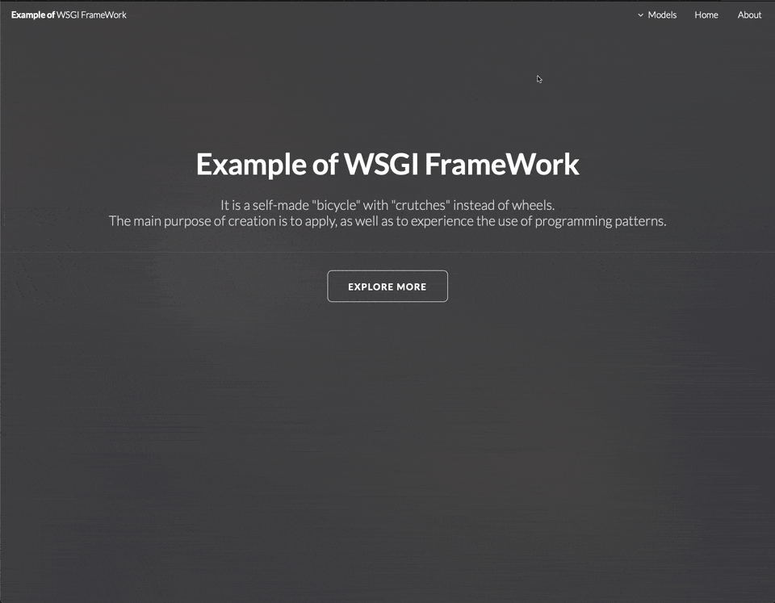

# **Emample of** WSGI Framework

This is a self-made "bicycle" or wheel which is a self-written analog of the Django framework.
The main purpose of creation is to apply, as well as to experience the use of programming patterns.

## Quick start

For starting progect you should clone project to your folder. And after this execute the following command:

```bash
make run # under hood run container
```



## List of tasks for this project

- [1. Паттерны web-представления](README/tasks/01_lesson.md)
- [2. Архитектура python-приложений](README/tasks/02_lesson.md)
- [3. Принципы проектирования](README/tasks/03_lesson.md)
- [4. Порождающие паттерны](README/tasks/04_lesson.md)
- [5. Структурные паттерны](README/tasks/05_lesson.md)
- [6. Поведенческие паттерны](README/tasks/06_lesson.md)
- [7. Архитектурные системные паттерны](README/tasks/07_lesson.md)
- [8. Антипаттерны](README/tasks/08_lesson.md)
- [9. Микросервисная архитектура](README/tasks/09_lesson.md)
